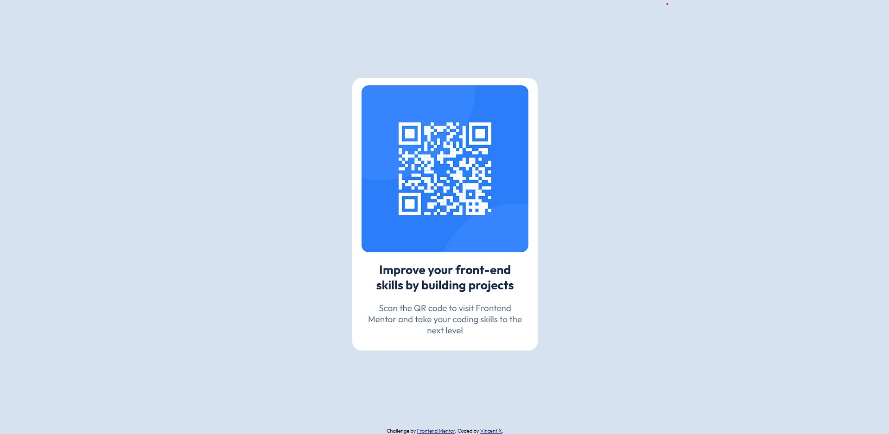

# Frontend Mentor - QR code component solution

This is a solution to the [QR code component challenge on Frontend Mentor](https://www.frontendmentor.io/challenges/qr-code-component-iux_sIO_H). Frontend Mentor challenges help you improve your coding skills by building realistic projects. 

## Table of contents

- [Overview](#overview)
  - [Screenshot](#screenshot)
  - [Links](#links)
- [My process](#my-process)
  - [Built with](#built-with)
  - [What I learned](#what-i-learned)
## Overview

### Screenshot

### Links

- Solution URL: [Add solution URL here](https://your-solution-url.com)
- Live Site URL: https://qr-code-verillyh.netlify.app/

## My process

### Built with

- Semantic HTML5 markup
- Flexbox
- A simple media query
### What I learned

I've learned a bit of git, and github along the way, just a little, but enough to get started.
It's also my first time setting up a live site url, so that's a plus.
Coding wise though, I haven't learned much, maybe in the next project