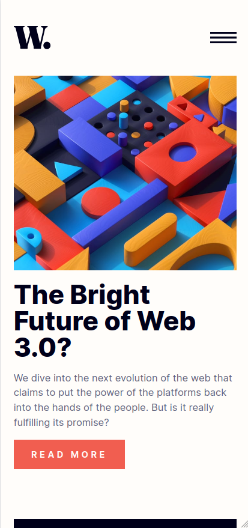
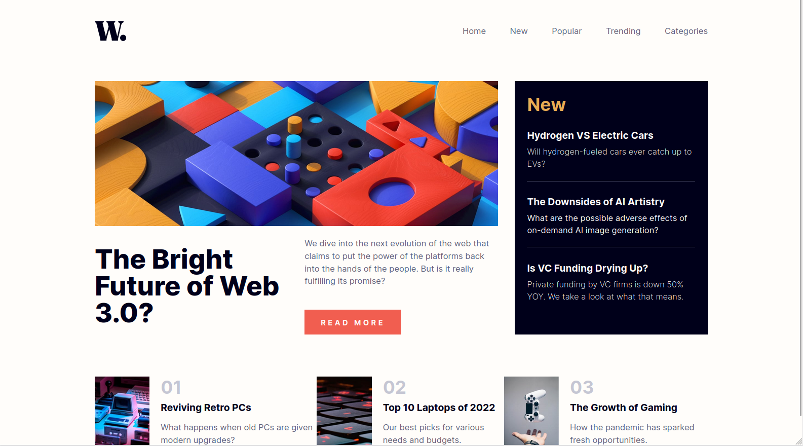

# Frontend Mentor - News homepage solution

This is a solution to the [News homepage challenge on Frontend Mentor](https://www.frontendmentor.io/challenges/news-homepage-H6SWTa1MFl). Frontend Mentor challenges help you improve your coding skills by building realistic projects. 

## Table of contents

- [Overview](#overview)
  - [The challenge](#the-challenge)
  - [Screenshot](#screenshot)
  - [Links](#links)
- [My process](#my-process)
  - [Built with](#built-with)
  - [What I learned](#what-i-learned)

## Overview

### The challenge

Users should be able to:

- View the optimal layout for the interface depending on their device's screen size
- See hover and focus states for all interactive elements on the page

### Screenshot

### Links

- Solution URL: https://splendorous-griffin-cc059e.netlify.app/
- Live Site URL:  https://www.frontendmentor.io/solutions/newshomepage-with-css-grid-JdXdnDtrWB

## My process

### Built with

- SCSS
- CSS Grid
- Mobile-first workflow

### What I learned

This is my first time using a mobile-first workflow, so that's pretty interesting. I've also learnt using grid better than before.